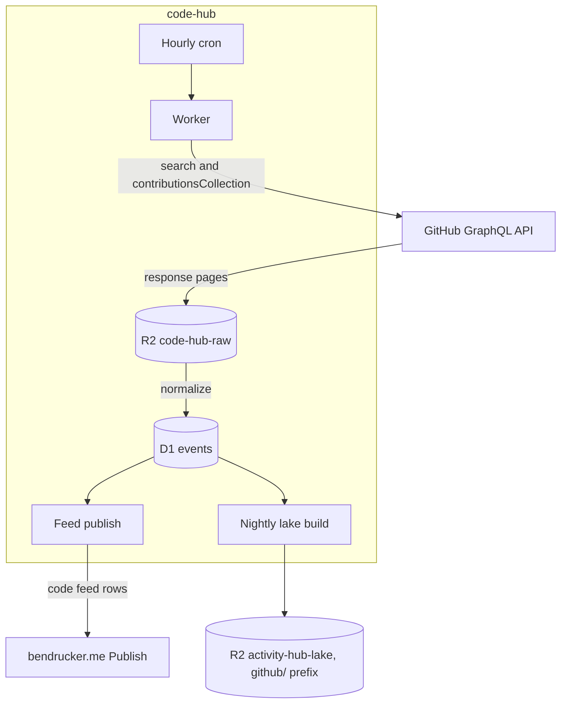

# Code Hub

System of record for my GitHub contribution data. An hourly Worker pulls pull requests, reviews, issues, and commit counts from GitHub's GraphQL API, archives every response page in R2, and publishes one row per event to [bendrucker/bendrucker.me](https://github.com/bendrucker/bendrucker.me).

## Why

The website's own GitHub sync stores one aggregate row per repository per year. That shape cannot answer "this month", cannot count lifetime repositories without double counting one across years, and cannot produce a record like largest PR or most reviews in a week. Every new number on the homepage costs another aggregate table, a backfill script, and a cache validator. One row per event makes each of those a SQL query instead.

[Activity Hub](https://github.com/bendrucker/activity-hub) is the sibling project and the wrong home for this. Its pipeline is built on one activity being one raw file: a webhook delivers a pointer, the original FIT or GPX becomes the immutable record in R2, and a container decodes it into Parquet. GitHub has no file per event, no webhook for repositories I contribute to but do not own, and nothing to decode. What carries over is the boundary layer rather than the pipeline: raw responses in R2 before anything normalizes them, Parquet into the same lake bucket, and the site's `Publish` entrypoint as the only write path.

## Architecture

One Worker, one D1 database, one hourly cron, and R2 for both raw pages and lake output. No queues and no container.



The raw bucket is the system of record. Rebuilding the event tables after a schema change replays those pages and spends no GitHub requests, which matters when a full backfill is a few hundred search calls.

Lake tables land under a `github/` prefix in the `activity-hub-lake` bucket that Activity Hub already writes. Sharing one bucket is what lets a single DuckDB session join rides against pull requests by day, and it is the only real cross-project concern.

The site is a read-only consumer. Writes reach its D1 only through the `Publish` entrypoint it exposes over a service binding, which validates every row on arrival and answers a bad shape with a `ValidationError`. The binding carries no credential and tells the callee nothing about who called. That method list is the whole security boundary.

See [docs/design.md](docs/design.md) for the full design, the extraction budget, and the decisions still open.

## Data Model

One row per event, at the grain GitHub hands over without crawling each repository.

| Table           | Grain                                                                                                                                                                             |
| --------------- | --------------------------------------------------------------------------------------------------------------------------------------------------------------------------------- |
| `pull_requests` | One PR I authored: repository, number, title, created at, merged at, closed at, state, additions, deletions, changed files, comment and review counts, base repository visibility |
| `reviews`       | One review I gave: repository, PR number, state, submitted at, PR author                                                                                                          |
| `issues`        | One issue: repository, number, title, created at, closed at, state, comment count                                                                                                 |
| `commit_days`   | One repository on one day, carrying that day's commit count                                                                                                                       |
| `repositories`  | The dimension: owner, name, description, url, stars, primary language, created at, fork, visibility                                                                               |

A sync state table alongside these records the last window read per event type. Commits are daily counts because that is how `contributionsCollection` already exposes them. Per-commit history, comment bodies, and individual review comments stay out of the first version. Each one needs a walk of every PR in every repository, and per-PR counts give most of the analytics value at a hundredth of the requests.

## Secrets

| Secret         | Location                              | Consumer                     |
| -------------- | ------------------------------------- | ---------------------------- |
| `GITHUB_TOKEN` | Worker secret (`wrangler secret put`) | Every GitHub GraphQL request |
| `ADMIN_TOKEN`  | Worker secret (`wrangler secret put`) | Bearer auth on `/admin/sync` |

The GitHub token's scope decides what the hub can see. What it publishes is a separate question, still open in [docs/design.md](docs/design.md).

`ADMIN_TOKEN` is optional. Without it `/admin/sync` answers 404, so a deployment that has not set one exposes no admin surface at all.

## Infrastructure

`wrangler.jsonc` owns the Worker, the `DB` D1 binding, the `RAW` and `LAKE` R2 bindings for `code-hub-raw` and `activity-hub-lake`, and the hourly cron trigger. The service binding to the site joins them when publishing lands. Migrations apply to production D1 from CI on merge to `main`.

There is no Terraform here. Activity Hub needs it for a DNS record, a Workers route, and the Cloudflare Access applications in front of its admin routes. This hub is reached by cron and by a service binding, so it has no hostname to manage. `/admin/sync` sits behind `ADMIN_TOKEN` alone, with no Access application in front of it.

## Development

```sh
bun install
bun run dev
```

| Command             | What it does                                   |
| ------------------- | ---------------------------------------------- |
| `bun run dev`       | Runs the Worker locally                        |
| `bun run test`      | Runs the test suite                            |
| `bun run typecheck` | Type checks without emitting                   |
| `bun run lint`      | Lints                                          |
| `bun run format`    | Formats                                        |
| `bun run types`     | Regenerates Worker types from `wrangler.jsonc` |

## Status

Scaffold only. Nothing is deployed, no extraction code exists, and bendrucker.me still runs its own GitHub sync. The open decisions in [docs/design.md](docs/design.md) come before the first query.
