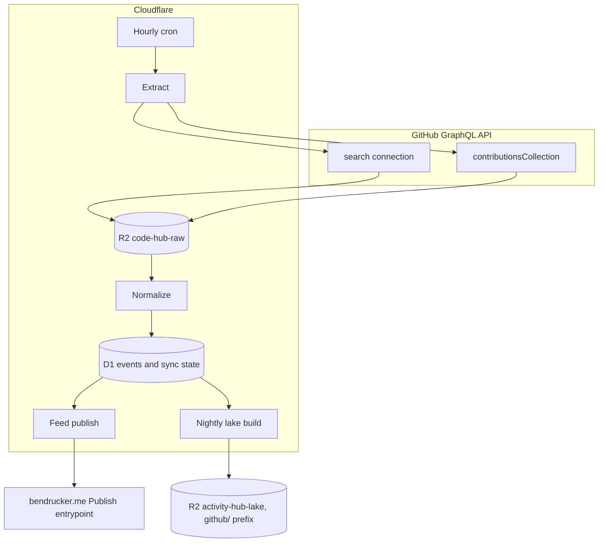

# Design

Code Hub owns my GitHub contribution history. It extracts events from GitHub's GraphQL API, archives every response page in R2, normalizes them into D1, publishes a feed to [bendrucker/bendrucker.me](https://github.com/bendrucker/bendrucker.me), and writes Parquet into the lake [Activity Hub](https://github.com/bendrucker/activity-hub) already maintains. This document records the architecture and the decisions behind it. The [README](../README.md) is the short version.

## Goals

- Own the data. Every API response page lands in R2 before anything parses it. A schema change then replays history instead of re-querying GitHub.
- One row per event, so month, year, and lifetime totals are each a SQL query rather than another aggregate table with its own backfill.
- Separate contributions to other people's repositories from work on my own, because those are different claims about what I do.
- Publish a code feed to bendrucker.me on the same terms as the ride feed: the site validates on arrival, owns its schema, and reads only.
- Join code against rides in one DuckDB session by writing Parquet into the shared lake bucket.

## Non-Goals

- Comment bodies, individual review comments, and per-commit history. Each needs a walk of every pull request in every repository or a query per repository per branch.
- Real-time freshness. An hourly cron is enough for a homepage, and no faster cadence is reliable while GitHub's search index lags writes by an unspecified interval.
- Webhooks. GitHub delivers them for repositories I own, which is a fraction of the repositories a contribution feed cares about.
- Multi-user support. One account, single-tenant everywhere.
- Queues and containers. Nothing here needs decoding, and the incremental run is a handful of requests inside one Worker invocation.

## Architecture

One Worker, one D1 database, one hourly cron, and R2 for both raw pages and lake output.



#### Worker

The cron runs extraction, normalization, and publishing in one invocation. There is no queue between the stages because the incremental run is a handful of requests: one windowed search per event type plus one `contributionsCollection` call for the current year. A backfill is larger and runs from an admin route or a script against the same code path, paged so no single invocation runs past its wall clock.

#### Raw Storage

Every response page is written to R2 before it is parsed, keyed by what produced it.

```text
raw/
  search/{kind}/{window}/{fetched_at}/{page}.json   # kind is pr-authored, pr-reviewed, or issue
  contributions/{year}/{fetched_at}.json            # one contributionsCollection window
```

An object is written once and never rewritten. Re-running a window writes new pages under a new fetch timestamp rather than replacing what a previous run saw. A normalization bug stays diagnosable against the bytes that caused it. The bucket is small: a search page of 100 nodes is tens of kilobytes and the whole history is a few hundred pages.

#### Normalization

Normalization reads the newest fetch under each window and writes D1. It never calls GitHub. That split is what makes a schema change cost nothing: bump the shape, re-run normalization over the archived pages, and the event tables rebuild from the responses already on disk.

Upserts are keyed on GitHub's node ID, so re-normalizing the same page changes no rows. An event that appears in two overlapping windows lands once.

#### Lake

A nightly build reads D1 and writes Snappy Parquet under `github/v1/` in the `activity-hub-lake` bucket, one file set per table. The build is a full rebuild rather than an incremental merge, which is affordable because the corpus is tens of thousands of rows rather than millions of telemetry samples.

Sharing Activity Hub's bucket is deliberate. A query that asks which weeks had both high mileage and high review volume is one DuckDB session over two prefixes, and any other arrangement makes it a data transfer problem.

The build runs inside the Worker, which is what holds containers to the non-goal above. `hyparquet-writer` encodes Parquet in pure JavaScript under workerd, and twenty thousand rows take tens of milliseconds.

Snappy rather than ZSTD because that writer ships no ZSTD compressor. Asking for ZSTD does not fail. It records the codec, stores the page uncompressed, and produces a file no reader accepts, so the codec is named at the call rather than left to a default. Activity Hub writes ZSTD from DuckDB in its container, and DuckDB reads either prefix without being told which.

Timestamps land as Parquet `TIMESTAMP_MILLIS` rather than the ISO strings D1 holds, since DuckDB then reads them as timestamps with no cast. `commit_days.day` stays a `YYYY-MM-DD` string, because it keys a daily count rather than naming an instant. `published_at` stays out of the lake, being the publisher's queue marker rather than something GitHub said.

## Data Model

#### Identity

Every event's primary key is the GraphQL node ID GitHub returns, which is stable across renames of the repository and of the owner. `owner`, `name`, and `number` are stored beside it for readability and for joins against the repository dimension.

#### Tables

| Table           | Columns                                                                                                                                                                   |
| --------------- | ------------------------------------------------------------------------------------------------------------------------------------------------------------------------- |
| `pull_requests` | Node ID, repository, number, title, created at, merged at, closed at, state, additions, deletions, changed files, comment count, review count, base repository visibility |
| `reviews`       | Node ID, repository, pull request number, state (approved, changes requested, commented), submitted at, pull request author                                               |
| `issues`        | Node ID, repository, number, title, created at, closed at, state, comment count                                                                                           |
| `commit_days`   | Repository, day, commit count                                                                                                                                             |
| `repositories`  | Owner, name, description, url, stargazer count, primary language name and color, created at, fork, visibility                                                             |

Additions, deletions, changed files, and the comment and review counts come off the pull request node's own fields. They cost nothing beyond the search page that already returned the node, and a record like largest PR falls out of them without opening a single diff.

`reviews` carries the pull request's author so reviews of my own work are separable from reviews I gave someone else. That distinction is the reason the table exists as its own grain rather than as a count on `pull_requests`.

Commits are per-repository daily counts because that is the finest grain `contributionsCollection` exposes without a query per repository per branch. `commitContributionsByRepository.contributions.nodes[]` carries a `commitCount` and an `occurredAt`, and one year of them is one request.

#### Sync State

`sync_state` is a key/value table. One key per event type holds the last window normalized successfully, and `updated_at` says when. The watermark advances only after the pages are in R2 and the rows are in D1. A failed run re-reads its window instead of skipping past it.

## Extraction

The search connection is the workhorse because it pages without bound when windowed by date. The `contributionsCollection` query supplies commits and the totals that cross-check everything else.

#### Search Windows

The `search` query returns [a maximum of 1,000 results](https://docs.github.com/en/graphql/reference/search#query-search) no matter how many matched, and hitting that ceiling is silent. Monthly windows keep every query well underneath it:

- `is:pr author:bendrucker created:2012-12-01..2012-12-31`
- `is:pr reviewed-by:bendrucker created:2012-12-01..2012-12-31`
- `is:issue author:bendrucker created:2012-12-01..2012-12-31`

The upper bound is the month's real last day. A literal `-31` against a thirty-day month is a date GitHub's parser has to reinterpret, and these boundaries are what the whole cap mitigation rests on.

Walking those back to 2012 is roughly 150 requests per event type for the whole history. The incremental run is the same code path with a different window: one `updated:>{last successful sync}` query per type. Backfill and incremental differ only in what dates go into the string.

#### Contributions Collection

`user.contributionsCollection(from, to)` takes at most a year per request. Its [`to` argument](https://docs.github.com/en/graphql/reference/users#object-user) defaults to the earlier of now and a year past `from`, and a wider window is rejected. A full history is one request per year. `user.contributionsCollection.contributionYears` lists which years to walk.

`commitContributionsByRepository` returns a plain list rather than a paginated connection, and its `maxRepositories` argument defaults to 25. Anything past the value it is given is dropped with no error and no cursor to follow. The site's existing query asks for 100 across every one of these fields and warns when a list comes back exactly that long. That shape carries over: a year holding exactly the maximum is treated as truncated the same way a search window holding exactly 1,000 is.

The same query asks for the collection's own totals: `totalCommitContributions`, `totalPullRequestContributions`, `totalPullRequestReviewContributions`, `totalIssueContributions`, `totalRepositoriesWithContributedCommits`, and `restrictedContributionsCount`. Those are the cross-check. A year whose event table count disagrees with GitHub's own total means a search window truncated or a private contribution is being counted on one side and not the other.

#### Rate Budget

The GraphQL API allows [5,000 points per hour](https://docs.github.com/en/graphql/overview/rate-limits-and-node-limits-for-the-graphql-api#primary-rate-limit) for a personal access token, and it scores a query on how many nodes it asks for. A search page of 100 nodes with no nested connection under it is one point. Nested connections multiply rather than add. A query that grows a sub-connection costs more than its node count reads on the surface. The full backfill is a few hundred requests, which fits inside a single hour's budget with room to spare. The incremental run is noise against it.

Each response carries `rateLimit.remaining`, `rateLimit.cost`, and `rateLimit.resetAt`. The extractor reads them and stops before exhausting the budget rather than after. A run that would overrun ends on a watermark it can resume from.

#### Validation

Responses are validated with zod at the boundary, types are inferred from the schemas, and nothing is cast. Two patterns in the site's existing `packages/github/src/schema.ts` are worth carrying over whatever happens to that package:

- A `nodes()` helper collapsing a connection's nullable list of nullable entries into a plain list, since callers only ever iterate it.
- A `pageInfo` discriminated union pairing `hasNextPage: true` with a required `endCursor`. A page that announced a successor without the cursor to reach it would otherwise send the paginator back to the first page for as long as it kept going.

## Site Integration

#### Feed Contract

The hub publishes a `code_feed` the way Activity Hub publishes `activity_feed`: one row per event, storing what GitHub said and converting nothing. The site's `Publish` entrypoint gains a method, or a second entrypoint, that validates each row by name on arrival.

The service binding carries no credential and gives the callee no caller identity. The method list is the entire security boundary: one event per call, upsert and delete only, no bulk write and no read. A shape violation comes back as a `ValidationError`. Only an error's `name` and `message` cross the RPC boundary, which is why the hub branches on that name to park a row that will never be valid instead of retrying it.

Publishing is driven off D1 rather than off the extraction watermark. Each event row records when it was last published, and the cron sends whatever the normalizer touched more recently than that. An RPC failure that is not a `ValidationError` leaves the marker unmoved and the row goes again on the next run. A site outage costs a retry rather than a re-extraction.

The repository dimension publishes too. The site's `repos` table exists only to serve the code page. The hub owning it removes the last reason for the site to talk to GitHub at all.

#### Cache Validators

The site's activity pages and homepage key their ETags on `sync_state.version`, which `recordSync` bumps when a sync changed rows. Whatever the publish path writes has to bump that same version or those pages serve stale ETags against fresh data. `src/middleware.ts` and `src/middleware/cache.ts` read it.

#### What the Site Retires

Once the hub publishes, running both syncs means two writers disagreeing about the same page. These go:

- `workers/github`, the hourly cron.
- `packages/github`, the client.
- `scripts/backfill-github-activity.ts` and `scripts/fetch-github-activity.ts`.
- The `repo_activity` schema, one aggregate row per repository per year.

`src/pages/activity/code.astro` and `src/activity/query.ts` move onto the feed.

Site migrations apply to production D1 only on push to `main`, and PR previews share the production database. A preview cannot read a table its own migration has not applied yet. The schema change lands and merges before the code that reads it.

#### Homepage Needs

The feed exists to answer these without a bespoke table per question:

- Totals by month, by year, and all time, for pull requests, reviews, and a third figure that sums cleanly across periods. Commits work. Repositories do not, because a repository touched in two years is one repository and two rows.
- Lifetime records for a ticker: first repository year, most-starred repositories contributed to, largest pull request by changed lines.
- The recent-repositories list the code rail already shows.

## Backfill

Backfill and incremental sync are the same code with different windows, so there is no second implementation to keep correct.

- Walk monthly search windows back to 2012 for each event type. I created my first repository on 2012-12-27, and nothing earlier will match.
- Walk `contributionsCollection` per year over `contributionYears`.
- Write every page to R2, then normalize.

It runs from an admin route or a local script rather than from the cron, paged so a single invocation stays inside its wall clock and resumes from the sync state row on the next call.

Re-normalizing costs no GitHub requests, which is the point of writing raw pages first. The event tables can be rebuilt as many times as the schema changes.

For sizing: the site's current tables report 62 repositories touched in 2026, with 852 pull requests, 28 reviews, and 321 issues for that year. Extrapolating over a decade puts the event tables in the low tens of thousands of rows, which is small for D1 and smaller for Parquet.

## Operations

- The hourly cron runs one `updated:>` search per event type plus one `contributionsCollection` call for the current year.
- `GITHUB_TOKEN` is a Worker secret, set with `wrangler secret put`. It is the only credential the hub holds.
- Migrations apply to the hub's D1 from CI on merge to `main`, matching how the site and Activity Hub both work.
- An admin route reports the last successful sync per event type, the lag on the oldest window still unread, and recent failures, in the shape of Activity Hub's `/admin/pipeline`.
- The `contributionsCollection` totals are checked against event table counts per year. Drift is the signal that a window truncated, and there is no other way to notice a silent 1,000-result cap.
- The backfill is roughly 500 search requests plus one per contribution year. That sits inside the 1,000 subrequests a paid Workers invocation gets and an order of magnitude past the free tier's 50, so paging it across invocations is a platform constraint before it is a wall clock one.
- Backoff reads `rateLimit` off each response rather than waiting for a 403. The existing `rateLimitBackoff` in the site's `scripts/backfill-github-activity.ts` is the shape to follow.

## Risks

- The search cap is silent. A window that returns exactly 1,000 results has probably lost rows and says nothing about it. Monthly windows keep the real counts far below, and the totals cross-check is the detector rather than the prevention.
- GitHub's search index lags writes by an unspecified interval, so an `updated:>` window anchored exactly at the last sync can miss an event indexed late. The window overlaps the previous one, and upserts keyed on node ID make the overlap free.
- `commitContributionsByRepository` returns a fixed-length list and reports no truncation. A year coming back exactly as long as the `maxRepositories` it was given has probably lost commit rows for everything past it, and `totalRepositoriesWithContributedCommits` from the same query is the count to check that against.
- `restrictedContributionsCount` counts contributions hidden from the viewer. Whether an owner's own scoped token still sees those is worth confirming against the live API before the cross-check subtracts the field, because the drift alarm is wrong in one direction or the other if the assumption is.
- Search discovers only what exists. A pull request or repository deleted on GitHub stops matching every window and its rows go stale in place. Nothing here reconciles that, and a periodic re-walk of past windows is the only cheap detector.
- Token scope defines the visible history. A token that loses access to an organization makes those events unfetchable, and the raw bucket becomes the only copy of them.
- The cutover has two writers on the site's code page. Retiring the site's sync belongs in the same change that turns on publishing.

## Open Decisions

These come before the first extraction code, because each one changes what gets stored rather than only what gets shown.

#### Visibility

The token sees private repositories. A feed row counting a private pull request names its repository on the site unless a layer removes it. Which layer owns that, and whether private activity counts toward totals at all:

- Filter at ingest. The hub never stores a private event, so nothing downstream can leak one. Totals understate real activity, and reversing the choice means a backfill.
- Filter at publish. The hub stores everything and sends only public rows. The lake stays complete for private analysis, and the site cannot show private counts even as an anonymous number.
- Publish counted but unnamed. Private events reach the site with the repository redacted, so totals are complete and no private name appears. The site then needs a render path for a row with no repository to link to.

#### Which Searches Define Involvement

`author:` alone undercounts reviews and co-authored work. `involves:` overcounts drive-by mentions. The site's current sync splits the difference, using `involves:` for issues and `is:pr is:merged user:bendrucker -author:bendrucker` for merged pull requests into my own repositories, which counts work other people did that I merged. The set to pick from:

- `author:` and `reviewed-by:` only. Every row is work I did, and the numbers are defensible without a footnote.
- Add `involves:` for issues, which catches issues I participated in but did not open, along with every thread that mentioned me.
- Keep merged-into-my-repositories as its own event type rather than folding it into pull request counts, since it measures maintenance rather than authorship.

Whichever set wins gets documented here, because a homepage number is uninterpretable without knowing which query produced it. It interacts with the visibility decision above: a wider involvement set pulls in more repositories, and more repositories means more of them private.

#### Whether to Lift `packages/github`

- Lift it. The zod schemas, the `nodes()` helper, and the paginated search wrapper exist and are tested, and the `contributionsCollection` query is already written.
- Write a new client. The package is shaped around per-repository aggregation, which is exactly what this project replaces, and every one of its search queries pulls the full repository fragment onto each node.

The zod discipline carries either way: validate at the boundary, infer the type from the schema, never cast.

## Future Work

Out of scope until the feed is live:

- Publishing the lake tables to R2 Data Catalog as Iceberg, following whatever Activity Hub settles on.
- A precomputed stats object regenerated by the nightly build, which would serve most homepage numbers at zero query cost.
- Comment and review-comment bodies, once there is a question that needs the text rather than the count.
- Per-commit history for my own repositories, where the request cost is bounded by repositories I own rather than by every repository I have touched.
